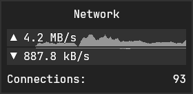
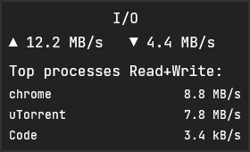

A minimalistic monochrome skins for [Rainmeter](https://www.rainmeter.net/)

- [Requirements](#requirements)
- [Skins](#skins)
  - [Uptime](#uptime)
  - [CPU](#cpu)
  - [Memory](#memory)
  - [GPU](#gpu)
  - [Network](#network)
  - [I/O](#io)
  - [Drive](#drive)
  - [Player](#player)
- [Other meter specific configuration variables](#other-meter-specific-configuration-variables)
- [Common configuration](#common-configuration)
  - [Sizes](#sizes)
  - [Font](#font)
  - [Colors](#colors)
  - [Symbols](#symbols)
  - [Update dividers](#update-dividers)
- [Localization](#localization)

## Requirements

- Windows 10
- [Rainmeter](https://www.rainmeter.net/) 4.3.1 or higher
- [HWiNFO](https://www.hwinfo.com/). Use version < 7.0.0 unless you have Pro subscription or don't mind checking a checkbox in HWiNFO settings once in 12 hours (e.g. [v6.42](https://www.fosshub.com/HWiNFO-old.html), [read why](https://docs.rainmeter.net/tips/hwinfo/)). Installer is preferable since Portable seems to have problems with autostart
- [JetBrains Mono](https://www.jetbrains.com/lp/mono/) font, unless you want use font of your choice

## Skins

You can open all skins config (`Config.inc`) by clicking on "Open Config" item in the a skin context menu

### Uptime

Displays system uptime

  
Configuration

See `Uptime` section in `Config.inc`

- `UptimeBorderTop`, `UptimeBorderRight`, `UptimeBorderBottom` and `UptimeBorderLeft` - Toggles skin border visibility

### CPU

Displays CPU usage/temperature values and values as line meter, processes count and 1-5 top processes. When "CPU" label is hovered the processor name is displayed as a tooltip

  
Configuration

See `CPU` section in `Config.inc`

- `CPUHWiNFOSensorId` and `CPUHWiNFOSensorInstance` - CPU Sensor ID and Instance (**Sensor Details** section in "HWiNFO Shared Memory Viewer") that provides CPU temperature value. See "Setting HWiNFO related values" section in `Config.inc` for more details
- `CPUHWiNFOTemperatureEntryId` - CPU temperature Entry ID (**Entry Details** section)
- `CPUTopProcessesCount` - Number of top processes using CPU displayed. Setting value to `0` hides "Top processes" block
- `CPUBorderTop`, `CPUBorderRight`, `CPUBorderBottom` and `CPUBorderLeft` - Toggles skin border visibility

### Memory

Displays RAM usage and 1-5 top processes using RAM. When used memory bar is hovered a percent of used memory is displayed

  
Configuration

See `Memory` section in `Config.inc`

- `MemoryTopProcessesCount` - Number of top processes using RAM displayed. Setting value to `0` hides "Top processes" block
- `MemoryBorderTop`, `MemoryBorderRight`, `MemoryBorderBottom` and `MemoryBorderLeft` - Toggles skin border visibility

### GPU

Displays GPU usage (GPU Core Load), temperature, fan speed, memory usage and 1-5 top processes using GPU. When memory bar is hovered a percent of used memory is displayed. When "GPU" label is hovered the GPU adapter name is displayed as a tooltip

  
Configuration

See `GPU` section in `Config.inc`

- `GPUHWiNFOSensorId` and `GPUHWiNFOSensorInstance` - GPU Sensor ID and Instance
- `GPUHWiNFOTemperatureEntryId` - GPU Temperature Entry ID
- `GPUHWiNFOFanEntryId` - GPU Fan Entry ID. Set to `-1` to disable (in case when GPU does not have a fan)
- `GPUHWiNFOCoreLoadEntryId` - GPU Core Load (usage) Entry ID
- `GPUHWiNFOMemoryAllocatedEntryId` - GPU Memory Allocated (memory used) Entry ID
- `GPUIndex` - Key under `HKEY_LOCAL_MACHINE\SYSTEM\ControlSet001\Control\Class\{4d36e968-e325-11ce-bfc1-08002be10318}\` corresponding the GPU. Usually it's `0000`, but depending on how many GPUs are in the system it can be `0001`, `0002`, etc. Check registry to get correct one - it must contain `HardwareInformation.qwMemorySize` record. Or check whether tooltip on "GPU" label on the skin displays correct name
- `GPUTotalMemory` (Default: -1) - GPU total memory in bytes. Set when `HardwareInformation.qwMemorySize` is missing in the registry. Set to -1 to use value from registry
- `GPUTopProcessesCount` - Number of top processes using GPU displayed. Setting value to `0` hides "Top processes" block
- `GPUBorderTop`, `GPUBorderRight`, `GPUBorderBottom` and `GPUBorderLeft` - Toggles skin border visibility

### Network

Shows Download/Upload speed in kB/s and connections count

  
Configuration

See `Network` section in `Config.inc`

- `NetworkMaxDownloadMbits` and `NetworkMaxUploadMbits` - Maximum download/upload speed of your network. Use http://speedtest.net to get these values
- `NetworkInterface` - Network interface name. Set if default value doesn't match your network adapter
- `NetworkBorderTop`, `NetworkBorderRight`, `NetworkBorderBottom` and `NetworkBorderLeft` - Toggles skin border visibility

### I/O

Displays I/O information (file, network and device I/Os).

  
Configuration

See `I/O` section in `Config.inc`

- `IOTopProcessesCount` - Number of top processes using I/O displayed. Setting value to `0` hides "Top processes Read+Write" block
- `IOBorderTop`, `IOBorderRight`, `IOBorderBottom` and `IOBorderLeft` - Toggles skin border visibility

### Drive

Displays drive's free space, temperature, activity, read/write speed. When disk label is hovered drive identifier and total size are displayed.

  
Configuration

See `Drives` section in `Config.inc`

You might want to load `Drive_Header` skin to add header for drives skins

- `DriveHWiNFOSMARTSensorId` - S.M.A.R.T. Sensor ID (the same for all drives)
- `Drive1`...`Drive6` - Drive's letter (e.g. `C:`)
- `Drive1HWiNFOSensorInstance`...`Drive6HWiNFOSensorInstance` - S.M.A.R.T. Sensor Instance
- `Drive1HWiNFOTemperatureEntryId`..`Drive6HWiNFOTemperatureEntryId` - S.M.A.R.T. Drive Temperature Entry ID
- `Drive1HWiNFORemainingLifeEntryId`..`Drive6HWiNFORemainingLifeEntryId` - S.M.A.R.T. Drive Remaining Life Entry ID. Only available for SSD. Set to `-1` for HDD
- `DrivesHeaderBorderTop`, `DrivesHeaderBorderRight`, `DrivesHeaderBorderBottom` and `DrivesHeaderBorderLeft` - Toggles Drives Header skin border visibility
- `Drive1BorderTop`...`Drive6BorderTop`, `Drive1BorderRight`...`Drive6BorderRight`, `Drive1BorderBottom`...`Drive6BorderBottom` and `Drive1BorderLeft`...`Drive6BorderLeft` - Toggles skin border visibility

### Player

Displays currently playing track information - track title, track artist and track duration. It has basic controls - previous track, pause/play. next track. When header label is clicked player is launched/closed

  
Configuration

See `Player` section in `Config.inc`

- `PlayerName` - Player application name (see [supported players list](https://docs.rainmeter.net/manual/measures/nowplaying/#playerlist))
- `PlayerTitle` - Skin header text (e.g. "My Jukebox")
- `PlayerPath` - Player executable absolute path
- `PlayerBorderTop`, `PlayerBorderRight`, `PlayerBorderBottom` and `PlayerBorderLeft` - Toggles skin border visibility

## Other meter specific configuration variables

See `Temperature` section in `Config.inc`

- `TemperatureUnit` - Temperature unit to use. `C` for Celsius, `F` for Fahrenheit, `K` for Kelvin
- `TemperatureMax`- Maximum temperature. It's needed for line meter

## Common configuration

### Sizes

- `SkinWidth` - Skin width in pixels
- `BarHeight` - Height of a bar meter
- `LineMeterHeight` - Height of a line meter

### Font

[Default configuration](src/@Resources/Config.inc) contains adjustments for [JetBrains Mono](https://www.jetbrains.com/lp/mono/) font.

If you want to use another font you'll need to change font-related variables in `Config.inc`:

- `FontFace` - Font to use
- `FontTopPaddingFix` - Top offset for bar and short line meters (e.g. Drive free space)
- `LineMeterStringTopFix` - Bottom top offset for string located in the top of meter higher than one text row (e.g. CPU usage %).
- `LineMeterStringBottomFix` - Bottom offset for string located in the bottom of meter higher than one text row (e.g. Drive write speed)
- `FontSize` and `LineHeight` - Main font size and line height
- `FontSizeSmall` and `LineHeightSmall` - Smaller font size and line height
- `StringEffect` - Font effect type - `Border`, `Shadow` or `None`
- `FontEffectColor` - Font effect color
- `FontColor` - Default font color
- `FontColorDim` - Dimmed font color (less important information)
- `FontColorDisabled` - Font color for disabled label (not important information like zero write speed)

### Colors

- `SkinBackground` - Skin background color
- `MeterBackground` - Meter box background color
- `MeterColor` - Accent color
- `SeparatorColor` - Border color

### Symbols

- `WriteSpeedPrefix` and `ReadSpeedPrefix` - Symbols to use as prefixes for write/read speed

### Update dividers

- `UpdateDividerCPUTopProcess` - CPU Top processes update divider ([read more about dividers](https://docs.rainmeter.net/tips/update-guide/))
- `UpdateDividerMemoryTopProcess` - Memory Top processes update divider
- `UpdateDividerGPUTopProcess` - GPU Top processes update divider
- `UpdateDividerIOTopProcess` - I/O Top processes update divider
- `UpdateDividerTemp` - Temperature update divider
- `UpdateDividerFan` - Fan speed update divider
- `UpdateDividerMemory` - Used memory update divider
- `UpdateDividerDriveSpace` - Drive space update divider

## Localization

You can chose language to be used for labels by setting `Locale` variable in the config. Supported locales are "en" and "ru". Feel free to add other locales via PR
